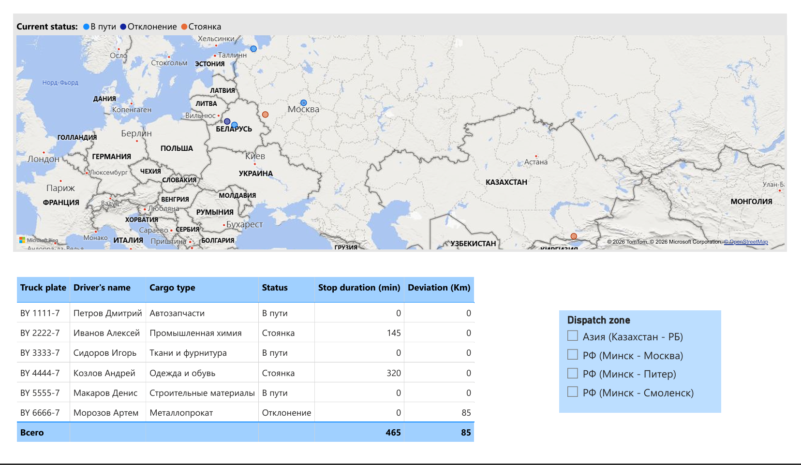
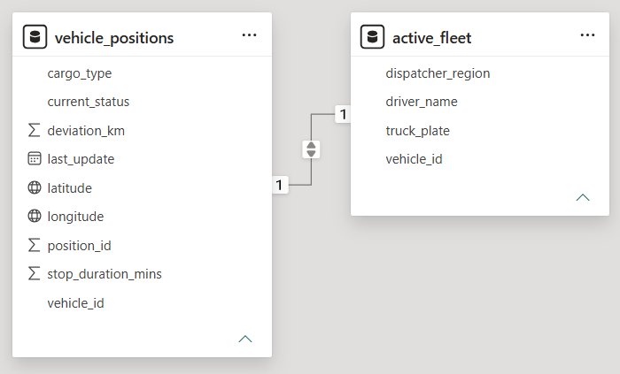

# Fleet Dispatch Control Shield: Real-Time Logistics Exception Management

## Project Overview
A dynamic operational BI dashboard built for Fleet Dispatchers to manage international truck movements across the EU-CIS corridor by exception. Shifting away from passive history tracking, this project acts as a live control shield that filters out normal operations and highlights only active transit crises requiring immediate logistics intervention.

  

[Download Fleet_Dispatch_Control_Shield (.pbix)](./Fleet_Dispatch_Control_Shield.pbix)

## Operational Context & Sanctions Reality
In the current geopolitical climate, managing full truckload (FTL) and refrigerated cargo involves complex border transshipment ("перецепка/перегрузка") workflows at Belarus-EU borders (e.g., Kozlovichi terminal). Idle time at customs and route deviations directly hemorrhage cash. This tool visualizes real-time fleet telemetry to mitigate these exact bottlenecks.

## Management by Exceptions Logic
A single dispatcher often monitors 30+ trucks simultaneously, making manual individual vehicle checks highly inefficient. This project applies strict data logic to isolate and surface only three high-priority incident triggers:
1. **Critical Stops (`stopped`):** Detects vehicles stationary at customs or transit zones for over 30 minutes, calculating exact delay duration.
2. **Route Deviations (`off_route`):** Triggers an immediate alert if a truck strays more than 5 kilometers from its planned tracking path.
3. **Normal Status (`en_route`):** Suppressed from immediate alerts to allow dispatchers to focus 100% of their attention on fleet recovery.

## Technical Framework

  

* **Telemetry Data Backend:** Simulates active GPS streams via a MySQL `vehicle_positions` log table, recording precise latitude, longitude, stop timers, and regional dispatcher ownership tags.
* **Geographical BI Visualization:** Power BI maps coordinate points dynamically, color-coding markers by live urgency (Green = OK, Yellow = Delayed at Customs, Red = Off-Route/Lost).
* **Security & Ownership Filters:** Built-in regional filtering allows a dispatcher (e.g., East Region vs. West Region) to view only the trucks under their direct operational command.

---
---

# Диспетчерский щит управления сбоями: управление логистикой в реальном времени по исключениям

## Обзор проекта
Динамичный операционный BI-дашборд для диспетчеров автопарка, предназначенный для управления международными перевозками по коридору ЕС–СНГ по принципу «исключений». В отличие от пассивного отслеживания истории, этот проект действует как живой щит, который отсеивает штатные операции и подсвечивает только активные кризисные ситуации, требующие немедленного вмешательства логистов.

  

[Скачать Fleet_Dispatch_Control_Shield (.pbix)](./Fleet_Dispatch_Control_Shield.pbix)

## Операционный контекст и реалии санкций
В текущих геополитических условиях управление полными автоперевозками (FTL) и рефрижераторными грузами включает сложные процессы перецепки/перегрузки на границах Беларуси с ЕС (например, терминал Козловичи). Простои на таможне и отклонения от маршрута напрямую приводят к финансовым потерям. Этот инструмент визуализирует телеметрию автопарка в реальном времени, чтобы смягчить эти узкие места.

## Логика управления по исключениям
Один диспетчер часто отслеживает одновременно 30+ машин, что делает ручную проверку каждого транспортного средства крайне неэффективной. Этот проект применяет строгую логику для выделения только трёх типов инцидентов высокого приоритета:
1. **Критическая остановка (`stopped`):** Обнаруживает транспортные средства, стоящие на таможне или в транзитных зонах более 30 минут, с точным расчётом времени задержки.
2. **Отклонение от маршрута (`off_route`):** Мгновенное оповещение, если машина отклонилась более чем на 5 км от запланированного пути.
3. **Нормальный статус (`en_route`):** Скрывается из срочных оповещений, чтобы позволить диспетчеру сосредоточить 100% внимания на восстановлении работы флота.

## Техническая структура

  

* **Бэкенд телеметрии:** Симулирует активные потоки GPS через таблицу MySQL `vehicle_positions`, фиксируя точную широту, долготу, таймеры остановок и теги региональной принадлежности диспетчеров.
* **Географическая BI-визуализация:** Power BI динамически отображает координаты на карте, кодируя маркеры цветом в зависимости от срочности (Зелёный = OK, Жёлтый = Задержка на таможне, Красный = Сход с маршрута/Потеря).
* **Фильтры безопасности:** Встроенная региональная фильтрация позволяет диспетчеру (например, Восточный регион vs. Западный регион) видеть только машины под его прямым управлением.
